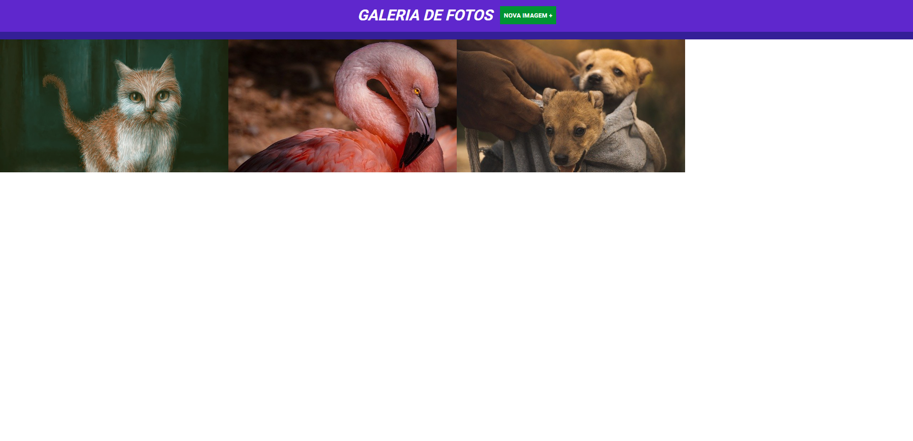

<h1 align="center">
  Calculadora de Médias Escolares
</h1>

## 📷 Deploy

<h3>LINK: https://hs-jquery-galeria-fotos-ten.vercel.app/</h3>

## 💻 Projeto

Neste projeto realizado em aula, pratiquei o uso de jQuery para a criação de uma galeria de fotos online.

## 🚀 Tecnologias

- jQuery
- HTML
- CSS

## 📝 Aprendizados

- [x] Manipulação do DOM com jQuery
